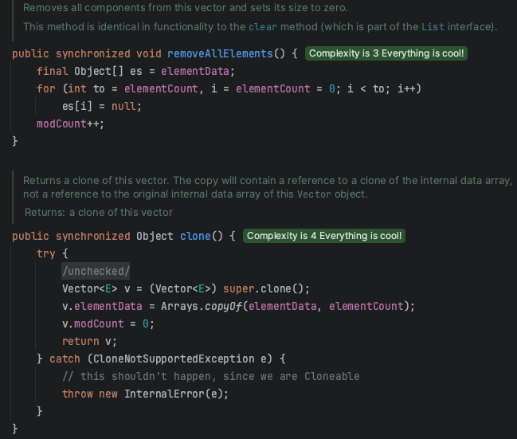

## 자료구조

선형 자료 구조(Linear Data Structure)
> 선형 자료구조란 요소가 일렬로 나열되어 있는 자료 구조

연결 리스트 (Linked List)
> 연결 리스트는 데이터를 감싼 노드를 포인터로 연결해서 공간적인 효율성을 극대화시킨 자료 구조이다.
> 삽입과 삭제가 O(1)이 걸리며 탐색에는 O(N)이 걸린다.

 

- 싱글 연결 리스트 (Singly Linked List)

> next 포인터만 가진다.

 

- 이중 연결 리스트 (Doubly Linked List)

> next 포인터와 prev 포인터를 가진다

 

- 원형 이중 연결 리스트 (Circular Doubly Linked List)

> 이중 연결 리스트와 같지만 마지막 노드의 next 포인터가 헤드 노드를 가리키는 것을 말한다

 

- 배열 (Array)

> 같은 타입의 변수들로 이루어져 있고, 크기가 정해져 있으며, 인접한 메모리 위치에 있는 데이터를 모아놓은 집합이다.
> 중복을 허용하고 순서가 있다.   
> '정적 배열' 기반으로 본다면, 탐색에 O(1) 랜덤 접근 가능하다. 삽입과 삭제에는 O(N)이 걸린다.   
> 데이터 추가와 삭제를 많이 할 경우: 연결 리스트   
> 탐색을 많이 할 경우: 배열

> 랜덤 접근은 직접 접근을 뜻하고 순서대로 나열한 데이터 구조이며 몇 번째 상자인지만 알면 해당 상자의 요소를 꺼낼 수 있다.

 

- 벡터 (Vector)

> 동적으로 요소를 할당할 수 있는 '동적 배열'이다. 컴파일 시점에 개수를 모른다면 벡터를 쓰면 된다.   
> 또한, 중복을 허용하고 순서가 있고 랜덤 접근이 가능하다.   
> 맨 뒤 요소를 삭제하거나 삽입하는 데 O(1)이 걸리고, 맨 뒤나 맨 앞이 아닌 요소를 삭제하고 삽입하는 데 O(N)의 시간이 걸린다.

> Vector는 ArrayList와 기능 상 거의 동일하다. 하지만 한 가지 다른 점이 `synchronized` 키워드 유무이다.

> `synchronized`는 멀티 쓰레드 환경에서 두개 이상의 쓰레드가 하나의 변수에 동시 접근할 때 Race condition(경쟁 상태)이 발생하지 않도록 한다.
> 쓰레드가 해당 메서드를 실행하는 동안 다른 쓰레드가 접근하지 못하도록 메서드를 잠금(Lock)을 거는 것이다.
> 그러면 Vector를 사용해야겠다! 싶겠지만 Vector는 완벽한 동기화가 아니고 몇 가지 문제점이 존재한다.
> 1. 강제 동기화로 인해 느려진 성능
> 2. 메서드 자체 실행으로는 쓰레드 세이프하지만, Vector 인스턴스 객체 자체에는 동기화 되지 않는다
> 3. Vector의 동기화를 위해 추가 처리 로직이 필요

 

- 스택 (Stack)

> 가장 마지막으로 들어간 데이터가 가장 먼저 나오는 성질(LIFO, Last In First Out)을 가지는 자료구조
> 재귀적인 함수, 알고리즘에 사용되고 웹 브라우저 방문 기록 등에 사용된다. 삽입 및 삭제에 O(1), 탐색에 O(N)이 걸린다.

 

- 큐 (Queue)

> 먼저 집어넣은 데이터가 먼저 나오는 성질(FIFO, First In First Out)을 가지는 자료구조
> 스택과는 반대되는 개념이고 삽입 및 삭제에 O(1), 탐색에 O(N)이 걸린다.   
> CPU 작업을 기다리는 프로세스, 스레드 행렬 또는 네트워크 접속을 기다리는 행렬, BFS, 캐시 등에 사용된다.