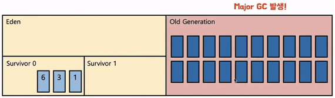

## 가비지 컬렉션 동작 원리와 GC 종류

<b>가비지 컬렉션(Garbage Collection)은 자바의 메모리 관리 방법 중 하나로 JVM의 Heap Area에서
동적으로 할당했던 메모리 중 필요 없게 된 메모리 객체를 모아 주기적으로 제거하는 프로세스</b>

C / C++ 언어에서는 이러한 가비지 컬렉션이 없어 프로그래머가 수동으로 메모리 할당과 헤제를 해주어야 했었다

반면 Java 언어에서는 가비지 컬렉터가 메모리 관리를 대행해주기 때문에 개발자 입장에서 메모리 관리, 메모리 누수(Memory Leak) 문제를 생각하지 않고 개발에만 집중할 수 있다는 장점이 있다

하지만, 모든 기술에는 양면이 존재하듯 가비지 컬렉션도 단점이 존재한다

자동으로 처리한다 해도 메모리가 언제 해제되는지 정확하게 알 수 없어 제어하기 힘들며,
가비지 컬렉션이 동작하는 동안에는 다른 동작을 멈추기 때문에 `오버헤드`가 발생되는 문제점이 있다

이를 전문용어 `Stop-The-World`라 부른다

```
STW는 GC를 수행하기 위해 JVM이 프로그램 실행을 멈추는 현상의 의미
```


GC가 너무 자주 실행되면 소프트웨어 성능 하락의 문제가 된다

이런 특성에 따라 실시간 특성이 강조되는 프로그램일 경우 가비지 컬렉터에게 메모리를 맡기는 것은 문제가 될 수 있다

---
<b>가비지 컬렉션 대상은 특정 객체가 garbage인지 여부를 판단하기 위해 도달능력(Reachability)라는 개념을 적용한다</b>

- Reachable: 객체가 참조되고 있는 상태
- Unreachable: 객체가 참조되고 있지 않은 상태 (GC 대상)


JVM 메모리에서는 객체들은 실질적으로 Heap 영역에서 생성되고 `Method Area`나 `Stack Area`는 `Heap Area`에 생성된 객체 주소만 참조하는 형식으로 구성

`Heap Area`의 객체들이 메서드 수행이 끝났을 때, 위 그림처럼 빨간색 객체와 같이 `Heap Area` 어디서든 `Unreachable`이 발생하게 된다

이러한 객체들을 주기적으로 가비지 컬렉터가 제거해준다

---
<b>가비지 컬렉션 청소 방식은 Mark And Sweep 과정을 사용하고 객체를 솎아내는 알고리즘이다</b>


원리는 가비지 컬렉션이 될 대상 객체를 식별(Mark)하고 제거(Sweep)하며 객체가 제거되어 파편화된 메모리 영역을 앞에서부터 채워나가는 작업(Compaction)을 수행한다

- Mark 과정: 먼저 `Root Space`로부터 그래프 순회를 통해 연결된 객체를 찾아 각각 어떤 객체를 참조하고 있는지 마킹한다
- Sweep 과정: 참조하고 있지 않은 객체 `Unreachable` 객체들을 Heap에서 제거한다
- Compact 과정: Sweep 후 분산된 객체들을 Heap 시작 주소로 모아 메모리가 할당된 부분과 그렇지 않은 부분으로 압축한다 (가비지 컬렉터 종류에 따라 하지 않은 경우도 있음)

```
✅ 여기서 잠깐!

GC의 Root Space는 Heap 메모리 영역을 참조하는 `Method Area`, `static 변수`, `Stack`, `Native Method Stack`이 된다
```


---
<b>Heap Area는 동적으로 레퍼런스 데이터가 저장되는 공간으로서, 가비지 컬렉션에 대상이 되는 공간이다</b>

`Heap Area`는 설계될 때 다음 2가지를 전제로 설계되었다.

1. 대부분의 객체는 금방 접근 불가능한 상태(Unreachable)가 된다
2. 오래된 객체에서 새로운 객체로의 참조는 아주 적게 존재한다

즉, 객체는 대부분 일회성이고, 메모리에 오랫동안 남아있는 경우는 드물다

이러한 특성으로 JVM 개발자들은 보다 효율적인 메모리 관리를 위해, 객체의 생존 기간에 따라 물리적인 Heap 영역을 나누었고 `Young`, `Old` 총 2가지 영역으로 설계했다

- Young Generation
    - 새롭게 생성된 객체가 할당(Allocation)되는 영역
    - 대부분 객체가 금방 `Unreachable` 상태가 되기 때문에, 많은 객체가 Young Generation에 생성되었다가 사라진다
    - Young Generation 영역에서 발생하는 가비지 컬렉션을 `Minor GC`라고 부른다
- Old Generation
    - Young Generation 영역에서 `Reachable` 상태를 유지하여 살아남은 객체가 복사되는 여역
    - Young Generation 영역보다 크게 할당되며, 영역의 크기가 큰 만큼 가비지 수행은 적게 발생한다
    - Old Generation 여역에 대한 가비지 컬렉션을 `Major GC` 또는 `Full GC`라고 부른다

Young Generation 영역은 더욱 효율적인 GC를 위해 3가지 영역(Eden, Survivor 0, Survivor 1)으로 다시 나눈다

- Eden
    - new 선언을 통해 새로 생성된 객체가 위치
    - 정기적인 쓰레기 수집 후 살아남은 객체들은 `Survivor`영역으로 보낸다
- Survivor 0 / Survivor 1
    - 최소 1번 이상의 GC에서 살아남은 객체가 존재하는 영역
    - Survivor 0 또는 Survivor 1 영역 둘 중 하나는 꼭 비어있어야 한다

```
✅ 여기서 잠깐!

Java 7까지는 Permanent가 Heap Area에 존재했지만 Java 8 이후에는 Native Method Stack에 편입되었다

Permanant는 생성된 객체들의 주소값이 저장되는 공간이다
클래스 로더에 의해 load되는 Class, Method 등에 대한 Meta 정보가 저장되는 영역

Java 8 이후에는 Native Method Area에 메타스페이스(Metaspace)에 저장된다
```


---
<b>Minor GC는 Young Generation 공간에서 발생하는 GC를 뜻하고
Old Generation 공간보다 상대적으로 공간이 작기 때문이 객체를 찾아 제거하는데 적은 시간이 걸린다</b>

+ 처음 생성되는 객체는 Young Generation 영역의 Eden에 위치


+ 객체가 계속 생성되어 Eden 영역이 꽉차게 되면 `Minor GC` 실행


+ Mark 동작을 통해 Reachable 객체 탐색


+ Eden 영역에서 살아남은 객체는 Survivor 영역으로 이동


+ Eden 영역에서 사용되지 않은 객체(Unreachable)의 메모리 해제(Sweep)


+ 살아남은 모든 객체들은 age 값 1 증가


```
✅ 여기서 잠깐!

age값은 Survivor 영역에서 살아남은 횟수를 의미하고, Object Header에 기록된다

age값이 임계값에 다다르면 Promotion(Old 영역 이동)여부를 결정한다

JVM 중 HotSpot JVM의 경우 age 기본 임계값은 31이다
객체 헤더에 age를 기록하는 부분이 6bit 이기 때문이다

만약 Survivor 2개 영역에 데이터가 모두 존재하거나, 존재하지 않는다면 시스템이 정상적인 상황이 아니라는 반증이다
```

+ 다시 Eden 영역에 신규 객체들이 가득차면 다시 `Minor GC`가 발생하고 Mark 한다


+ Marking 한 객체들을 비어있는 Survivor 영역으로 이동하고 Sweep


+ 다시 살아남은 모든 객체들 age가 1 증가


+ 위 과정을 반복

---
<b>Major GC는 Young Generation 영역에서 시작된 객체가 GC 과정 중에 제거되지 않은 경우
age 임계값이 차게되어 이동된 객체이다</b>

`Major GC`는 객체들이 계속 Promotion되어 Old Generation 영역에 메모리가 꽉 차면 발생한다
그래서 `Full GC`라고도 부른다

+ 객체 age 임계값이 8로 가정하고 도달하면


+ 이 객체들은 Old Generation 으로 이동된다. 이를 `Promotion`이라 부른다


+ 위 과정이 반복되어 Old Generation 영역의 공간(메모리)이 부족하면 `Major GC`가 발생한다



일반적으로 Young Generation 영역에서 발생하는 `Minor GC`는 0.5초 ~ 1초 사이에 끝난다

하지만, Old Generation 영역에서 발생하는 `Major GC`는 `Minor GC`보다 시간이 오래걸려, 10배 이상 시간을 사용한다

여기에서 `Stop-The-World` 문제가 발생한다

`Major GC`가 발생하면 Thread가 멈추고 `Mark And Sweep`작업을 해야해서 CPU에 부하를 주기 때문에 멈추거나 버벅이는 현상이 일어나기 때문이다

---
<b>가비지 컬렉션의 알고리즘 종류는 자바가 발전되고 Heap 사이즈가 커지면서 애플리케이션 지연(Suspend) 현상이 두드러지게 되었고,
이를 최적화 하기 위해 다양한 Garbage Collection 알고리즘이 개발 되었다</b>

+ Serial GC
    + 서버의 CPU 코어가 1개일 때, 사용하기 위해 개발된 GC
    + GC를 처리하는 쓰레드가 1개여서 `Stop-The-World` 시간이 길다
    + Minor GC는 `Mark-Sweep`을 사용하고, Major GC는 `Mark-Sweep-Compact`를 사용
    + 디바이스 성능이 안좋아 CPU 코어가 1개인 경우에만 사용
+ Parallel GC
    + Java 8의 기본 GC
    + Serial GC와 알고리즘이 같지만, Young Generation 영역의 Minor GC를 멀티쓰레드로 수행(Old Generation은 싱글 쓰레드)
    + Serial GC에 비해 `Stop-The-World` 시간 감소
+ Parallel Old GC
    + Parallel GC를 개선한 버전
    + Young Generation 영역 뿐 아니라, Old Generation 영역도 멀티쓰레드로 GC 수행
    + 새로운 가비지 컬렉션 청소 방식인 `Mark-Summary-Compact` 방식을 이용
+ CMS GC
    + 애플리케이션 쓰레드와 GC 쓰레드가 동시에 실행되어 `Stop-The-World` 시간을 최대한 줄이기 위해 고안된 GC
    + 단, GC 과정이 매우 복잡함
    + GC 대상을 파악하는 과정이 복잡하게 여러단계로 수행되기 때문에 다른 GC 대비 CPU 사용량이 높다
    + Java 9버전 부터 `Deprecated`되었고 결국 Java 14 버전에서 사용이 중지됨
+ G1 GC
    + CMS GC를 대체하기 위해 JDK 7 버전에서 최초로 release된 GC
    + Java 9+ 버전 기본 GC로 지정
    + 4GB 이상의 힙 메모리, `Stop-The-World` 시간이 0.5초 정도 필요한 상황에 사용 (Heap이 너무 작으면 미사용 권장)
    + 기존의 GC 알고리즘에서는 Heap 영역을 Young/Old 영역으로 나누어 사용했지만, G1 GC는 새로운 개념인 `Region`을 도입함.
    + 영역을 체스판 같이 분할하여 Eden, Suvivor, Old 등 역할을 고정이 아닌 동적으로 부여
    + Garbage가 가득찬 영역을 빠르게 회수하여 빈 공간을 확보, 결국 GC 빈도가 줄어드는 효과를 얻게됨


+ Shenandoah GC
    + Java 12 버전에서 release
    + 레드햇에서 개발한 GC
    + 기존 CMS가 가진 단편화, G1이 가진 Pause 이슈를 해결
    + 강력한 Concurrency와 가벼운 GC 로직으로 Heap 사이즈에 영향을 받지 않고 일정한 Pause 시간이 소요됨


+ Z GC
    + Java 15 버전에서 release
    + 대량의 메모리(8MB ~ 16TB)를 low-latency로 처리하기 위해 디자인 된 GC
    + G1 GC의 Region처럼, Z GC는 ZPage라는 영역을 사용하며, G1 Region은 크기가 고정인데, ZPage는 2MB 배수로 동적으로 운영됨 (큰 객체가 들어오면 2^N 영역으로 구성)
    + Z GC의 최대 장점 중 하나는 Heap 크기가 증가하더라도 `Stop-The-World`의 시간이 절대 10ms를 넘지 않는다는 것


