## JDK / JRE / JVM 개념

<b>JDK(Java Development)는 개발자들이 자바로 개발하는 데
사용되는 라이브리러들(javac, javadoc)과 개발 도구들을 포함하고 있고,
자바 프로그램을 실행 시키기 위한 JRE(Java Runtime Environment)도 함께 포함되는 키트이다.</b>

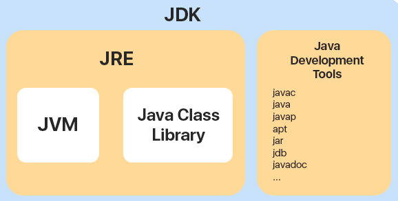

Oracle에서 제공하는 설치버전의 JDK는 NTFC 라이센스가 적용되어 상용서비스에 사용할 수 없다. (따로 돈을 지불)

이러한 Oracle에 정책으로 인해 무료 라이센스를 제공하는 또다른 JDK 버전을 여러 회사에서 출시했고 지금의 JDK 환경이 만들어졌다.

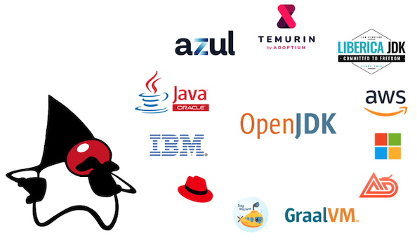

---
<b>JRE(Java Runtime Environment)은 자바 프로그램을 실행할 때 필요한 라이브러리 API를 함께 묶어 배포되는 패키지이다.</b>

기존에는 개별적으로 설치가 가능했지만 JDK11 버전부터 따로 제공되지 않고 JDK에 포함되어 있다.

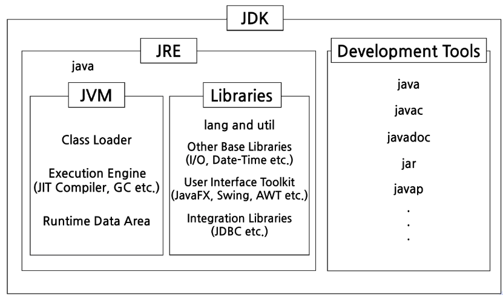

정리하면, Java로 프로그램을 직접 개발하려면 JDK가 필요하고, 컴파일된 Java 프로그램을 실행하려면 JRE가 필요하다.

---
<b>JVM(Java Virtual Machine)은 자바를 실행하는 가상 기기이다.</b>

자바로 작성된 모든 프로그램은 JVM에서만 실행될 수 있고, 자바 프로그램을 실행하기 위해서는 반드시 JVM이 설치되어야 한다.

JVM은 자바 실행 환경 JRM에 포함되어 있고 하드웨어에 자바 실행환경이(JRE) 설치되어 있다면 JVM도 설치되어 있다는 뜻이다.

이 JVM을 사용하는 구조로 인한 이점이 자바 프로그램을 모든 플랫폼에서 제약 없이 동작할 수 있다.

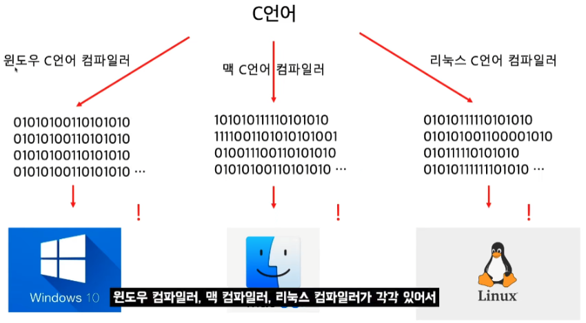

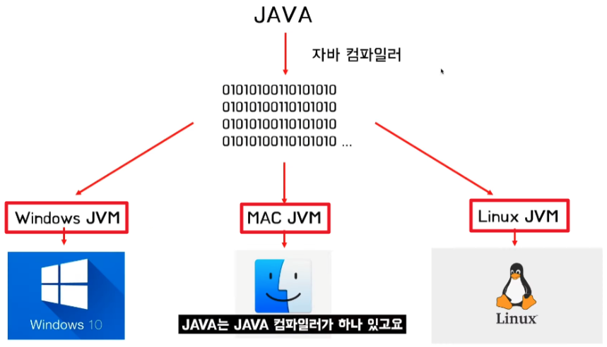

```
✅ 여기서 잠깐!

- C언어의 실행 (WOCA)
    - Write Once, Compile Anywhere 한번만 작성하고 컴파일하면 어디서든 사용 가능 하다
    - 특정 OS나 CPU 구조에 맞춰진 컴파일러에 의해 다르게 컴파일 된다 (운영체제별 독자적인 컴파일러)
- Java언어의 실행 (WORA)
    - Write Once, Read Anywhere 재컴파일할 필요 없고 바로 기계가 읽고 실행할 수 있게 한다
    - JVM을 거쳐서 운영체제와 상호작용 한다 (자바 가상 머신은 운영체제 종석적이다)
    
이 구조로 우리는 확인할 수 있다
왜? C언어가 Java 보다 실행속도가 빠를까에 대한 답을 얻을 수 있다
Java는 두번의 컴파일로 인한 속도 문제가 발생한다. 이를 보완하기 위해 JIT 컴파일러라는 내부 프로그램을 사용해서
필요한 부분만을 기계어로 바꾸어 줌으로써 성능 향상을 가져왔지만 C언어의 실행속도를 따라 잡지 못한다.
(왜 게임이나 임베디드에서 C계열 언어를 사용하는지 알 수 있다)
```

---
<b>자바 프로그램 실행 과정</b>

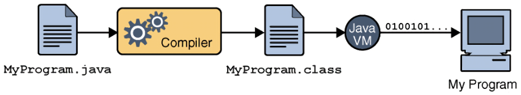

1. 소스코드(MyProgram.java)를 작성
2. 컴파일러(Compiler)는 자바 소스코드를 이용해 클래스 파일(MyProgram.class)을 생성. 컴파일 된 클래스 파일은 JVM(Java Virtual Machine)이 인식할 수 있는 바이트 코드
   파일이다
3. JVM은 클래스 파일의 바이트 코드를 해석하여 바이너리 코드로 변환하고 프로그램 수행
4. MyProgram 수행 결과가 컴퓨터에 반영

---

## JVM 내부 구조와 메모리 영역

<b>JVM의 동작 방식은 자바 애플리케이션을 클래스 로더를 통해 읽어 자바 API와 함께 실행한다.</b>

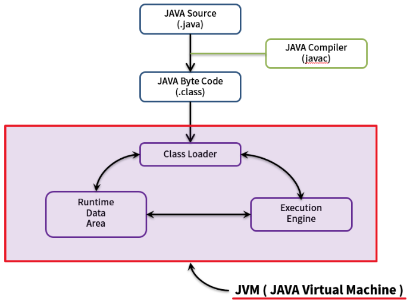

1. 자바 프로그램을 실행하면 JVM은 OS로부터 메모리를 할당
2. 자바 컴파일러(javac)가 자바 소스코드(.java)를 바이트 코드(.class)로 컴파일
3. Class Loader는 동적 로딩을 통해 필요한 클래스들을 로딩 및 링크 하여 Runtime Data Area(실질적인 메모리를 할당받아 관리하는 영역)에 올린다
4. Runtime Data Area에 로딩 된 바이트 코드는 Execution Engine을 통해 해석된다
5. 이 과정에서 Execution Engine에 의해 Garbage Collector의 작동과 Thread 동기화가 이루어진다

아래 그림은 JVM 구조를 조금 더 상세화 한 도식(schema)이다

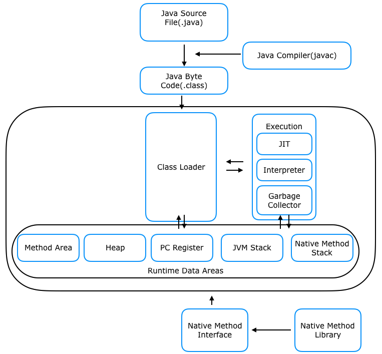

---
<b>클래스 로더(Class Loader)는 JVM 내부로 클래스 파일(*.class)을 동적으로 로드하고, 링크를 통해 배치하는 작업을 수행하는 모듈이다</b>

즉, 로드된 바이트 코드(.class)들을 엮어서 JVM의 메모리 영역인 Runtime Data Area에 배치한다

클래스를 메모리에 올리는 로딩 기능은 한번에 메모리에 올리지 않고, 애플리케이션에서 필요한 경우 동적으로 메모리에 적재한다

클래스 파일의 로딩 순서는 3단계로 구성된다 (Loading → Linking → Initialization)

1. Loading(로드): 클래스 파일을 가져와서 JVM의 메모리에 로드
2. Linking(링크): 클래스 파일을 사용하기 위해 검증하는 과정
    + Verifying(검증): 읽어들인 클래스가 JVM 명세에 명시된대로 구성되어 있는지 검사
    + Preparing(준비): 클래스가 필요로하는 메모리를 할당
    + Resolving(분석): 클래스의 상수 풀 내 모든 심볼릭 레퍼런스를 다이렉트 레퍼런스로 변경
3. Initialization(초기화): 클래스 변수들을 적절한 값으로 초기화

---
<b>실행 엔진(Execution Engine)은 클래스 로더를 통해 런타임 데이터 영역에 배치된 바이트 코드를 명령어 단위로 읽어서 실행</b>

자바 바이트 코드(.class)는 기계가 바로 수행할 수 있는 언어가 아닌 가상머신이 이해할 수 있는 언어로 컴파일된 코드이다

그래서 실행 엔진은 바이트 코드를 실제로 JVM 내부에서 기계가 실행할 수 있는 형태로 변경한다

이 수행 과정에서 실행 엔진은 인터프리터와 JIT 컴파일러 두 가지 방식을 혼합하여 바이트 코드를 실행한다

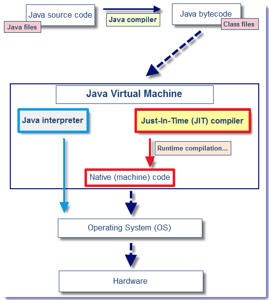

<b>인터프리터(Interpreter)</b>는 바이트 코드 `명령어를 하나씩 읽어서 해석하고 바로 실행`한다

JVM안에서 바이트코드는 기본적으로 인터프리터 방식으로 동작하는데 같은 메서드가 여러번 호출이 된다면 매번 해석하고 수행해야 되서 전체적인 속도는 느리다

<b>JIT 컴파일러(Just-In-Time Compiler)</b>는 인터프리터의 단점을 보완하기 위해 도입된 방식이다

반복되는 코드를 발견하여 `바이트 코드 전체를 컴파일하여 Native Code로 변경`하고 이후에는 캐싱해 두었다가 `네이티브 코드롤 직접 실행`한다

실행 속도는 인터프리팅 방식보다 빠르지만 바이트 코드를 Native Code로 변환하는 비용이 소요된다

JVM은 모든 코드를 JIT 컴파일러 방식으로 실행하지 않고 인터프리터 방식을 사용하다 일정 기준이 넘어가면 JIT 컴파일 방식으로 명령어를 실행한다

<b>가비지 컬렉터(Garbage Collector, GC)는 Heap 메모리 영역에서 더는 사용하지 않는 메모리를 자동으로 회수한다</b>

C언어의 경우 개발자가 직접 메모리를 해제 해야하지만, Java는 가비지 컬렉터를 이용해 자동으로 메모리를 실시간 최적화 시킨다

일반적으로 자동으로 실행되지만, GC(가비지 컬렉터)가 실행되는 시간은 정해져 있지 않다

---
<b>Runtime Data Area는 JVM 메모리 영역으로 자바 애플리케이션을 실행할 때 사용되는 데이터들을 적재하는 영역이다</b>

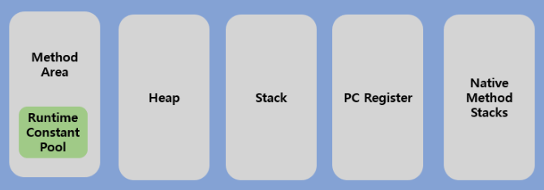

런타임 데이터 영역은 크게 `Method Area`, `Heap Area`, `Stack Area`, `PC Register`, `Native Method Stack`로 나눌 수 있다

`Method Area`, `Heap Area`는 모든 쓰레드(Thread)가 공유하는 영역이고, 나머지 `Stack Area`, `PC Register`, `Native Method Stack`은 각 쓰레드 마다
생성되는 개별 영역이다

아래는 자세히 표현된 도식(schema)이다

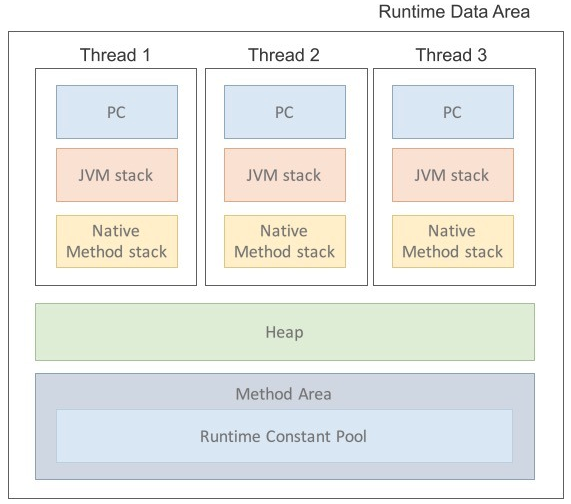

<b>메서드 영역(Method Area)은 JVM이 시작될 때 생성되는 공간으로 바이트 코드(.class)를 처음 메모리 공간에 올릴 때 초기화되는 대상을 저장하기 위한 메모리 공간</b>

JVM이 동작하고 클래스가 로드될 때 적재되서 프로그램이 종료될 때까지 저장

```
메서드 영억(Method Area)은 Class Area 또는 Static Area로도 불린다
```

모든 쓰레드가 공유하는 영역이라 아래와 같은 초기화 코드 정보들이 저장된다

- Field Info: 멤버 변수의 이름, 데이터 타입, 접근 제어자의 정보
- Method Info: 메서드 이름, return 타입, 함수 매개변수, 접근 제어자의 정보
- Type Info: Class 인지 Interface인지 여부 저장 Type 속성과 이름, Super Class의 이름

```
☑️ 메서드 영역 / 런타임 상수 풀의 사용기간 및 스레드 공유 범위
- JVM 시작시 생성
- 프로그램 종료 시까지
- 명시적으로 Null 선언 시

☑️ Runtime Constant Pool
- 메서드 영역에 존재하는 별도의 관리영역
- 각 클래스/인터페이스 마다 별도의 constant pool 테이블이 존재하고,
클래스 생성할 때 참조해야할 정보들을 상수로 가지고 있는 영역
- 상수 자료형을 저장하여 참조하고 중복을 막는 역할
```

<b>힙 영역(Heep Area)는 메서드 영역과 함께 모든 쓰레드가 공유하며,
JVM이 관리하는 프로그램에서 데이터를 저장하기 위해 런타임시 동적으로 할당하여 사용하는 영역</b>

즉, new 연산자로 생서되는 클래스와 인스턴스 변수, 배열 타입 등 `Reference Type`이 저장되는 곳.

당연한 소리지만 Method Area 영역에 저장된 클래스만이 생성이 되어 적재된다

```
☑️ 힙 영역의 사용기간 및 스레드 공유 범위
- 객체가 더 이상 사용되지 않거나 명시적으로 null 선언 시
- GC(Garbage Collection) 대상
```

유의할점은 힙의 참조 주소는 '스택'이 가지고 있고 해당 객체를 통해서만 힙 영역에 있는 인스턴스를 핸들링할 수 있다

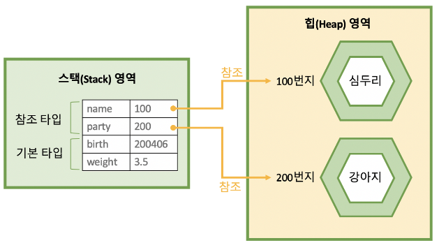

만약 참조하는 변수나 필드가 없다면 의미 없는 객체가 되기 때문에 이것을 쓰레기로 취급하고 JVM은 쓰레기 수집기인 `Garbage Collector`를 실행시켜 쓰레기 객체를 힙 영역에서 제거한다

이처럼 힙 영역은 가비지 컬렉션에 대상이 되는 공간이다

효율적인 가비지 컬렉션을 수행하기 위해 5가지 영역으로 나뉘게 된다

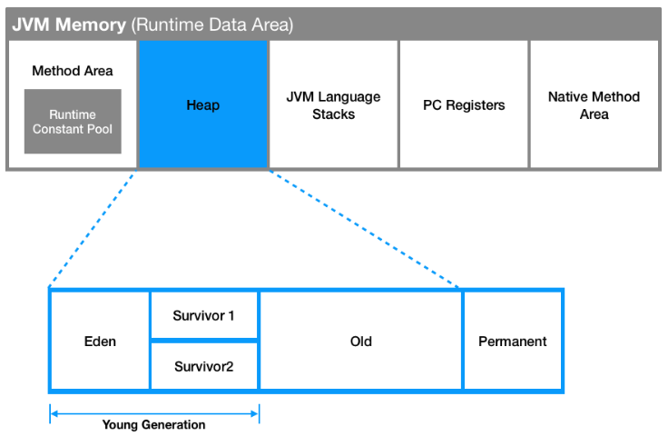

위 그림과 같이 다섯가지 영역으로 나뉜 힙 영역은 물리적으로 Young Generation 과 Old Generation 영역으로 구분된다

```
☑️ Young Generation
- 생명 주기가 짧은 객체를 GC 대상으로 하는 영역

☑️ Old Generation
- 생명 주기가 긴 객체를 GC 대상으로 하는 영역, Young Generation에서 마지막까지 살아남은 객체가 이동된다
```

<b>스택 영역(Stack Area)은 int, long, boolean 등 기본 자료형을 생성할 때 저장하는 공간으로, 임시적으로 사용되는 벼수나 정보들이 저장되는 영역</b>

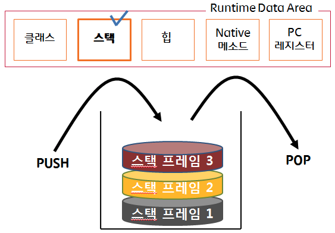

메서드 호출 시마다 각각의 스택 프레임(메서드만을 위한 공간)이 생성되고 메서드 안에서 사용되는 값들을 저장하고,
호출된 메서드의 매개변수, 지역변수, 리턴 값 및 연산 시 발생하는 값들을 임시로 저장한다

메서드 수행이 끝나면 프레임별로 삭제된다

```
✅ 여기서 잠깐!

스택 영역과 힙 영역에 저장 방식이 다르다는 것을 유의하자

예를들어, Person person = new Person(); 같이 클래스를 생성할 경우,
new 연산자로 생성된 클래스는 Heap Area에 저장되고, Stack Area에는 생성된 클래스의 참조인 person만 저장된다
```

스택 영역은 각 스레드마다 하나씩 존재하고, 스레드가 시작될 때 할당된다

여기까지 메소드 영역, 힙 영역, 스레드 영역을 한 그림으로 표현하면 아래와 같다

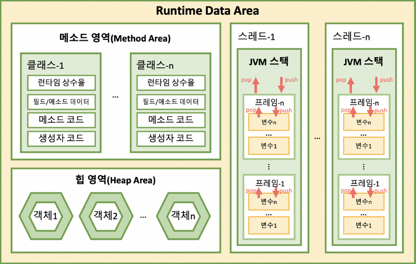

---
<b>PC 레지스터(Program Counter Register)는 쓰레드가 시작될 때 생성되며, 현재 수행중인 JVM 명령어 주소를 저장하는 공간</b>

JVM 명령의 주소는 쓰레드가 어떤 부분을 무슨 명령으로 실행해야할 지에 대하 기록을 가지고 있다

일반적으로 프로그램 실행은 CPU에서 명령어(Instruction)을 수행하는 과정으로 이루어진다

이때 CPU는 연산을 수행하는 동안 필요한 정보를 레지스터라고 하는 CPU내 기억장치를 이용한다

예를들어, A와 B라는 데이터와 피연산 값이 Operand가 있고 이를 더하라는 연산 Instruction이 있다 가정하자

A와 B, 그리고 더하라는 연산이 순차적으로 진행이 되는데, 이때 A를 받고 B를 받는 동안 이 값을 CPU가 어딘가에 기억해 두어야할 필요가 생긴다

이 공간이 바로 CPU내 기억장이 `Register`이다

하지만, 자바의 `PC Register`는 `CPU Register`와 다르다

자바는 OS나 CPU의 입장에서는 하나의 프로세스이기 때문에 JVM리소스를 이용해야 한다

그래서 자바는 CPU에 직접 연산을 수행하도록 하는 것이 아닌, 현재 작업하는 내용을 CPU에게 연산으로 제공해야 하며,
이를 위한 버퍼 공간으로 PC Register라는 메모리 영역을 만들게 된다

따라서 JVM은 스택에서 비연산값 `Operand`를 뽑아 별도의 메모리 공간이 `PC Register`에 저장하는 방식을 취하는 것이다

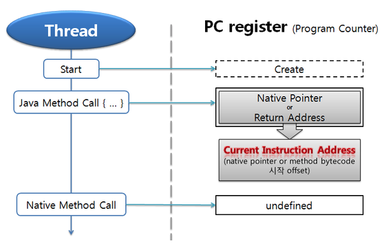

만약 스레드가 자바 메서드를 수행하고 있으면 JVM 명령(Instruction)의 주소를 PC Register에 저장

그러다 만약 자바가 아닌 다른 언어(C언어, 어셈블리)의 메서드를 수행하고 있다면, undefined 상태가 된다

왜냐하면 자바에서는 자바 메서드 수행과 네이티브 메서드 수행 따로 처리하기 때문이다

---
<b>네이티브 메서드 스택(Native Method Stack)은 자바 코드가 컴파일되어 생성되는 바이트 코드가 아닌
실제 실행할 수 있는 기계어로 작성된 프로그램을 실행시키는 영역</b>

또한 자바 이외의 언어(C, C++, 어셈블리 등)로 작성된 네이티브 코드를 실행하기 위한 공간이기도 하다

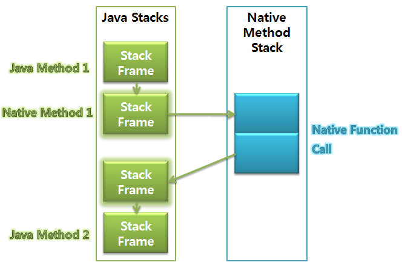

자바 메서드를 실행하는 경우 JVM 스택에 쌓이다가 해당 메서드 내부에 네이티브 방식을 사용하는 메서드가 있다면
해당 메서드는 네이티브 스택에 쌓인다

네이티브 메서드 수행이 끝나면 다시 자바 스택으로 돌아와 다시 작업을 수행한다

<b>JNI(Java Native Interface)는 자바가 다른 언어로 만들어진 애플리케이션과 상호 작용할 수 있는 인터페이스 제공 프로그램</b>

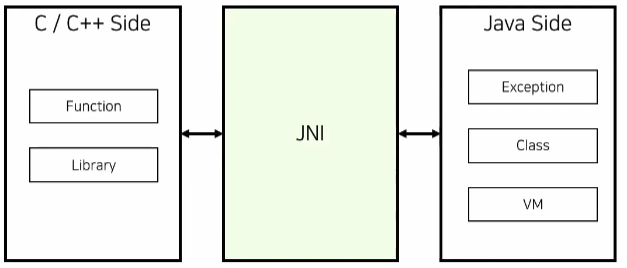

위에서 확인한것 같이, JNI는 JVM이 Native Method를 적재하고 수행할 수 있도록 한다

<b>네이티브 메서드 라이브러리(Native Method Library)는 C, C++로 작성된 라이브러리이고 만약 헤더가 필요하면 JNI는 이 라이브러리를 로딩해 실행한다</b>

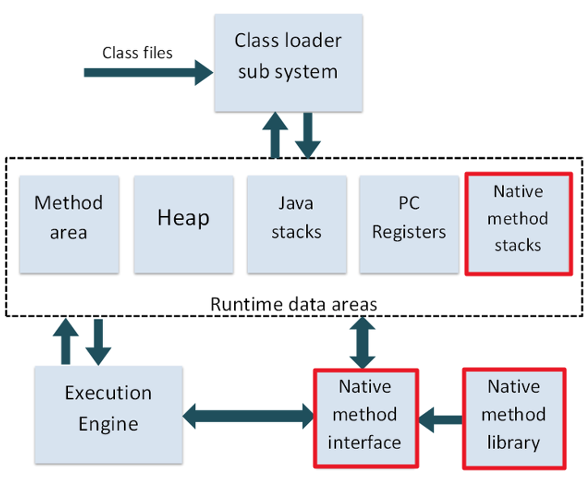

