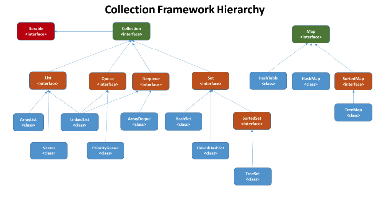

## 자바와 함께 알아보는 자료구조 (Data Structure) 기술 면접 준비

### Array란 무엇인가요?

Array는 인덱스와 인덱스에 대응하는 데이터들로 이루어진 자료 구조를 나타냅니다. 논리적 저장 순서와 물리적 저장 순서가 일치하며 인덱스로 해당 원소에 접근할 수 있습니다.

+ 원소의 인덱스 값을 알고 있으면 검색 및 수정에는 O(1)의 시간이 걸리지만 삽입이나 삭제가 필요한 경우에는 원소들을 shift 해주어야 하기 때문에 O(N)의 시간이 소요됩니다.

---
### LinkedList란 무엇인가요?

LinkedList란 각 노드가 데이터와 포인터를 가지고 연결되어 있는 방식으로 데이터를 저장하는 자료구조를 말합니다. 링크드 리스트 종류로는 단일, 이중, 원형 링크드 리스트가 존재합니다.

+ 링크드 리스트의 경우 인덱스가 존재하지 않기 때문에 검색 및 수정시 첫 번째 노드부터 순차적으로 모든 노드를 검색해야 합니다. 따라서 링크드 리스트의 탐색은 시간 복잡도 O(N)입니다.
+ 링크드 리스트의 경우 노드의 삭제와 삽입시 O(1)만에 해결할 수 있지만, 원하는 위치에 원소를 삽입하거나 삭제하는 경우 위치를 검색하는 시간이 필요하므로 O(N)의 시간이 소요됩니다.

---
### 선형 자료구조와 비선형 자료구조의 차이는 무엇인가요?

선형 자료구조는 데이터 요소들이 저장되어 있는 모습을 표현했을 때 일렬로 나열된 형태이고, 비선형 자료구조는 데이터 요소들이 저장되어 있는 모습을 표현했을 때 일렬로 나열된 형태가 아닌 것을 의미합니다.

+ 선형 자료구조의 대표적인 예는 Array, Queue 등이 있고, 비선형 자료 구조의 대표적인 예는 Tree, Graph 등이 있습니다.

---
### Stack이란 무엇인가요?

스택(Stack)이란 가장 마지막으로 들어간 데이터가 가장 먼저 나오는 성질(LIFO, Last In First Out)을 가지는 자료구조입니다.

+ 재귀적인 함수 알고리즘에 사용되고 웹 브라우저 방문 기록 등에 사용됩니다. 삽입 및 삭제에 O(1), 탐색에 O(N)이 걸린다.

---
### Queue란 무엇인가요?

큐(Queue)는 먼저 집어넣은 데이터가 먼저 나오는 성질(FIFO, First In First Out)을 가지는 자료구조입니다.

+ 스택과는 반대되는 개념이고 삽입 및 삭제에 O(1), 탐색에 O(N)이 걸린다.
+ CPU 작업을 기다리는 프로세스, 스레드 행렬 또는 네트워크 접속을 기다리는 행렬, BFS, 캐시 등에 사용된다.

---
### Tree란 무엇인가요?

트리(Tree)는 비선형 자료구조로서 node들과 이를 연결하는 edge들로 구성되어 있습니다.

+ 트리는 하나의 루트 노드를 갖습니다.
+ 트리 구조로 배열된 일정의 계층적 데이터의 집합입니다.
+ 순서나 규칙이 없는 트리의 경우 탐색시 O(N) 시간이 소요됩니다.

---
### Binary Tree(이진 트리)란 무엇인가요?

이진 트리(Binary Tree)는 자식의 노드 수가 두 개 이하인 트리를 의미합니다.

+ 정이진 트리(full binary tree): 자식 노드가 0개 또는 2개인 이진 트리를 의미합니다.
+ 완전 이진 트리(complete binary tree): 왼쪽에서부터 채워져 있는 이진 트리를 의미합니다. 마지막 레벨을 제외하고는 모든 레벨이 완전히 채워져 있으며,
마지막 레벨의 경우 왼쪽부터 채워져 있습니다.
+ 변질 이진 트리(degenerate binary tree): 자식 노드가 하나밖에 없는 이진 트리를 의미합니다.
+ 포화 이진 트리(perfect binary tree): 모든 노드가 꽉 차 있는 이진 트리를 의미합니다.
+ 균형 이진 트리(balanced binary tree): 왼쪽과 오른쪽 노드의 높이 차이가 1 이하인 이진 트리를 의미합니다. map,set을 구성하는 레드 블랙 트리는 균형 이진 트리 중 하나입니다.

---
### Binary Search Tree(이진 탐색 트리, BST)란 무엇인가요?

이진 탐색 트리란 노드의 오른쪽 하위 트리에는 '노드 값보다 큰 값'이 있는 노드만 포함되고, 왼쪽 하위 트리에는 '노드 값보다 작은 값'이 들어있는 트리를 의미합니다.

+ 왼쪽에는 작은 값, 오른쪽에는 큰 값이 이미 정해져 있기 때문에 요소를 찾을 때 O(logN)이 쇼오됩니다.
+ 최악의 경우 O(N)이 소요됩니다.

---
### Binary Heap이란 무엇인가요?

힙은 완전 이진 트리 기반의 자료 구조이며, 최소힙과 최대힙 두 가지가 있고 서로 다른 특징을 가지는 트리를 말합니다.

+ 최대힙: 루트 노드에 있는 키는 모든 자식에 있는 키 중에서 가장 커야 합니다. 또한, 각 노드의 자식 노드와의 관계도 이와 같은 특징이 재귀적으로 이루어져야 합니다.
+ 최소힙: 루트 노드에 있는 키는 모든 자식에 있는 키 중에서 최솟값이어야 합니다. 또한, 각 노드의 자식 노드와의 관계도 이와 같은 특징이 재귀적으로 이루어져야 합니다.

---
### Binary Heap과 Binary Search Tree는 각각 어떠한 경우에 사용하는게 좋나요?

Heap은 최대 및 최소 노드를 연산`O(1)`하는데 유용하지만, BST는 모든 노드를 연산`O(logN)`하는데 유용합니다.

---
### Red-Black Tree란 무엇인가요?

레드 블랙 트리는 균형 이진 탐색 트리로 탐색, 삽입, 삭제 모든 시간 복잡도가 O(logN)입니다.

+ 각 노드는 빨간색 또는 검은색의 색상을 나타내는 추가 비트를 저장하며, 삽입 및 삭제 중에 트리가 균형을 유지하도록 하는 데 사용됩니다.
+ 노드의 child가 없을 경우 child를 가리키는 포인터는 `NIL` 값을 저장합니다. 이러한 `NIL` 들을 leaf node로 간주합니다.

---
### 해시 테이블(Hash Table)이란 무엇인가요?

해시 테이블이란 임의의 길이를 가진 키를 고정된 길이의 Hash Code로 변환 시켜서 이를 인덱스로 사용하여 데이터를 저장하는 자료구조를 의미합니다.

---
### 해시 함수(Hash Function)이란 무엇인가요?

해시 함수란 고유한 키 데이터를 해시로 변환시키는 함수를 의미합니다. 이러한 함수로부터 얻어지는 값을 해시 값, 해시코드 짧게 줄여 해시라고도 합니다.

+ input 사이즈가 아무리 크더라도 output으로 나오는 사이즈는 고정된 길이를 가집니다.
+ output을 가지고 input을 유추할 수 없습니다.
+ 충돌(Collision)이 많아질수록 Search에 필요한 시간 복잡도가 O(1)에서 O(N)에 가까워진다.

---
### 해시 충돌이 왜 발생하고 해시 충돌 해결(Hash Collision Resolve) 방식에는 어떠한 방법이 존재하나요?

해시 충돌이 발생하는 이유는 서로 다른 key들이 같은 hash를 가질 때 발생하고 해시 함수의 반환 값은 다르지만 해시 테이블 인덱스에 사용하기 위한 모듈러 연산을 한 결과가 같을 때 해시 충돌이 발생합니다.

해시 충돌 해결은 크게 2가지 방법이 존재하는데요.

`Separate chaining`: 추가적인 공간을 활용하여 해결하는 방식입니다.
+ 각각의 버킷들을 Linked List로 만들어 사용
+ 각각의 버킷들을 Tree로 만들어 사용

`Open addressing`: 충돌 발생 시 인접한 비어있는 공간(bucket)에 저장하는 방식입니다.
+ Linear probing: 고정폭으로 이동하여 빈 공간을 찾는다.
+ Quadratic probing: 제곱수로 이동하여 빈 공간을 찾는다.
+ Double Hashing: 또 다른 Hash Function을 사용하여 빈 공간을 찾는다.

---
### Graph란 무엇인가요?

그래프란 Node들과 이를 연결하는 Edge들을 모아 놓은 비선형 자료구조입니다. 방향 및 비방향 그래프가 모두 존재하며, `self-loop`가 존재할 수 있습니다.

+ 그래프는 인접 행렬과 인접 리스트로 구현할 수 있습니다.

---
### Graph 탐색에는 어떠한 방법이 존재하나요?

그래프는 따로 규칙이 존재하지 않기 때문에 모든 정점을 탐색해야 합니다. 특정 정점을 기준으로 깊이 우선 탐색(DFS)과 너비 우선 탐색(BFS)이 존재합니다.

+ DFS는 Stack 및 재귀를 사용해 구현할 수 있고 BFS는 Queue를 사용해 구현할 수 있습니다.
+ 인접리스트로 구현할 경우에 시간 복잡도는 O(V+E)이구요, 인접 행렬로 구현할 경우에 시간 복잡도는 O(V^2)입니다.

---
### Minimum Spanning Tree란 무엇인가요?

최소 신장 트리(MST)란 그래프의 여러 Spanning Tree 중 Edge의 가중치 합이 최소인 Spanning Tree를 의미합니다.

---
### Minimum Spanning Tree를 구하는 알고리즘에는 어떤 방법이 존재하나요?

최소 신장 트리(MST)를 구하는 알고리즘에는 Edge 값이 가장 작은 것부터 탐색하는 대표적인 방법으로 `Kruskal Algorithm`과 `Prime Algorithm`이 존재합니다.

+ Kruskal Algorithm: `Edge`없이 `Vertex`로만 구성된 그래프를 만들어서 weight가 제일 작은 `Edge` 부터 검토 후 cycle이 생기지 않는 경우에만 `Edge`를 추가하는 방법을 의미하구요 시간 복잡도는 O(ElogE)입니다. 
+ Prime Algorithm: 한개의 `Vertex`로 구성된 그래프 A를 만들어서 그래프 A 내부에 있는 `Vertex`와 외부에 있는 `Vertex`사이의 `Edge`를 연결했을 때 가장 작은 weight를 가진 `Vertex`와 `Edge`를 그래프 A에 추가하는 방법을 의미하구요.
시간 복잡도는 O(ElogV)입니다.

---
### Java 8의 특징은 무엇인가요?

자바 8의 주요 특징으로는 자바에 함수형 프로그래밍이 처음으로 도입되었다는 것입니다. 새롭게 도입된 기능으로는 `Stream API`, `Lambda Expression`, `Method Reference`, `Optional Class`, `Functional Inteface`, `Default Methods` 등이 있습니다.

---
### Java 9의 특징은 무엇인가요?

자바 9의 주요 특징으로는 모듈화가 도입되었다는 것입니다. Package와 여러 데이터 자원을 포함하는 Module을 런타임시에 가져옴으로써 더 잘 구조화된 애플리케이션을 작성할 수 있게 되었고 성능을 향상시킬 수 있게 되었습니다.

---
### Java 10의 특징은 무엇인가요?

자바 10의 주요 특징으로는 Local Variable Type Interface가 도입되었다는 것입니다. 자바는 기존의 엄격한 타입 선언 방식에서 탈피하여 컴파일러에게 타입을 추론할 수 있게끔 해 개발자가 직접 지역 변수 타입을 작성하는 것을 없에 생산성을 증가시킬 수 있게 되었습니다.

---
### Java 11의 특징은 무엇인가요?

자바 11의 주요 특징으로는 새로운 HTTP 클라이언트인 `HttpClient`가 등장했다는 것입니다. 해당 라이브러리를 사용해서 개발자는 애플리케이션의 많고 복잡한 요구사항들을 처리할 수 있게 되었습니다.

---
### Stream API란 무엇인가요?

스트림 API란 자바에서 일련의 데이터 요소인 배열이나 컬럭션 등을 처리하기 위해 함수형 스타일을 지원해주는 API 입니다. 스트림 API를 사용하면 멀티 스레드를 활용해서 연산을 수행할 수 있고,
내부 반복으로 연산을 수행하기 때문에 코드가 매우 간단해집니다.

---
### Functional Interface란 무엇인가요?

함수형 인터페이스란 하나의 추상 메서드가 정의된 인터페이스를 의미합니다. 함수형 인터페이스의 예로는 `Predicate`,`Comparator`,`Runnable` 인터페이스 등이 존재합니다.

---
### Lamda Expression이란 무엇인가요?

람다 표현식이란 함수형 인터페이스를 구현하는 객체를 만들지 않고도 추상 메서드를 구현해서 해당 인터페이스를 사용할 수 있는 표현식을 의미합니다.
특정 인터페이스를 사용하기 위해 일회용 객체를 만들지 않아도 됨으로 효율적이라 생각합니다.

---
### Method Reference란 무엇인가요?

메서드 참조는 기존에 정의된 메서드와 동일한 람다 표현식을 매번 작성하는데 발생하는 불편함을 해결하기 위해 탄생한 기법이며 람다 표현식을 직접 작성하는 대신 기존의 메서드 정의를 이용하는 방법입니다.
이를 통해 개발자는 중복된 코드를 없앨 수 있으며 자연스레 생산성과 가독성 증가 효과를 얻을 수 있다고 생각합니다.

```java
// 람다 표현식
Function<String, Integer> lambdaLengthFunction = s -> s.length();

// 객체 메서드 참조
String str = "Hello Method Reference";
Function<String, Integer> methodReferenceFunction = str::length;

// 사용 예시
System.out.println(lambdaLengthFunction.apply("Hello"));  // 출력: 5
System.out.println(methodReferenceFunction.apply("Hello"));  // 출력: 5
```

---
### Optional 클래스는 무엇인가요?

Optional 클래스는 자바 8에서 새롭게 등장한 클래스이고 `java.util` 패키지에 속해 있습니다. Optional 클래스는 자바 프로그래머들이
가장 자주 접하는 예외인 NPE(NullPointerException)를 관리 하기 위해 기존 객체를 깜싼 `Wrapper Class`입니다.

---
### Default Method는 무엇인가요?

디폴트 메서드는 인터페이스에서 메서드 정의 뿐만 아니라 구현도 포함하는 메서드를 만들기 위해 사용되어집니다.
디폴트 메서드를 통해 인터페이스는 서브 클래스가 구현해야하는 최소한의 인터페이스 스펙을 유지할 수 있습니다.

---
### 추상클래스와 인터페이스의 차이는 무엇인가요?

추상클래스는 추상화된 클래스를 의미하고 인터페이스는 클래스에서 구현해야 하는 스펙을 의미합니다. 이러한 이유로 가장 큰 차이는 사용법에 존재한다고 생각합니다.
추상 클래스는 멤버 변수와, 메서드 명세, 구현 등 모든 부분이 상속 되기 때문에 코드의 재사용성을 위해서 사용하는 경우가 많고 인터페이스는 자바 8 이전에는 메서드 명세만 상속되었기 때문에 메서드 명세의 상속을 위해서 사용된다고 생각합니다.

---
### 오버라이딩(Overriding)과 오버로딩(Overloading)은 각각 무엇인가요?

오버라이딩이란 서브클래스가 상속받은 메서드를 해당 클래스에 맞게 재구현 하는 것을 의미하구요.
오버로딩이란 동일한 메서드 이름이지만 매개 변수 타입이나 개수가 다른 즉, 다른 명세를 가진 함수를 같은 클래스내에 만드는 것을 의미합니다.

---
### 업캐스팅(Up Casting)과 다운캐스팅(Down Casting)이란 무엇인가요?

업캐스팅이란 슈퍼 클래스의 변수에 서브 클래스의 인스턴스가 들어가는 것을 의미하구요. 다운캐스팅이란 업캐스팅 된 변수의 타입을 서브 클래스 타입으로 변경하는 것을 의미합니다.
서브클래스는 슈퍼 클래스의 명세를 상속받기 때문에 슈퍼 클래스 변수에 들어가서 슈퍼 클래스 인스턴스인 것처럼 사용될 수 있고 업캐스팅된 변수의 타입이 다시 서브 클래스로 돌아와서
다시 본인의 클래스 변수인 것처럼 사용될 수 있습니다.

---
### 제네릭(Generic)이란 무엇인가요?

제네릭이란 컴파일 타임에 타입체크와 불필요한 캐스팅 코드를 삭제하기 위해서 사용하는 기능입니다.

---
### String과 StringBuffer, StringBuilder의 차이를 설명해주세요.

모두 문자열을 다룰 수 있는 `java.lang`패키지의 클래스입니다. 하지만 `String`은 불변 객체이구요. `StringBuffer`와`StringBuilder`는 가변 객체입니다.
`StringBuffer`는 멀티스레드 환경에서 `thread-safe`하게 동작할 수 있는 동기화 기능을 지원하고 `StringBuilder`는 동기화 기능을 지원하지 않아 멀티스레드 환경에서 `thread-safe`하지 않습니다.

---
### Annotation이란 무엇인가요?

어노테이션이란 자바 5버전 부터 추가된 기능으로 소스코드에 메타데이터 정보를 추가하기 위해 사용되어집니다. 어노테이션은 컴파일 타임에 컴파일러에게 특정 정보를 제공해 주기 위해 사용되어지거나, 런타임에 JVM에게 특정 정보를 제공해 주기 위해서 사용되어집니다.

---
### Java Collection Framework에 대해서 설명해주세요.

자바에서 컬렉션이란 데이터의 집합과 그룹을 의미하며 이를 저장하고 연산할 수 있는 집합을 컬렉션 프레임워크(Collection Framework)라고 합니다.

컬렉션 프레임워크는 크게 2개의 명세로 나눌 수 있는데요. 순서나 집합인 저장 공간의 명세를 나타내는 `Collection`인터페이스와, 키와 값으로 데이터를 핸들링하는 명세를 나타내느 `Map`인터페이스로 나눌 수 있습니다.



---
### Set, List, Queue의 차이를 설명해주실 수 있나요?

리스트는 객체의 순서가 존재하며 원소가 중복될 수 있는 인터페이스 입니다. `List` 인터페이스의 대표 구현체는 `ArrayList`가 있습니다.

큐는 FIFO(First In First Out)의 특성을 가지고 있으며 원소가 중복될 수 있는 인터페이스 입니다. `Queue` 인터페이스의 대표적인 구현체는 `LinkedList`가 있습니다.

셋은 원소의 순서가 없고 동일한 원소를 중복 저장할 수 없는 인터페이스 입니다. `Set` 인터페이스의 대표적인 구현체는 `HashSet`,`TreeSet` 등이 있습니다.

---
### LinkedList와 ArrayList의 차이는 무엇인가요?

`ArrayList`는 내부적으로 원소를 배열에서 관리하고, `LinkedList`는 노드에 데이터를 저장하고 포인터를 사용해 앞뒤의 노드와 연결지어 데이터를 관리합니다.

+ 삽입 및 삭제시 `LinkedList`는 O(1)의 시간이 걸리고, `ArrayList`는 O(N)의 시간이 소요됩니다.
+ 탐색시 `ArrayList`는 O(1)의 시간 걸리고, `Linked List`는 O(N)의 시간이 소요됩니다.

---
### HashMap은 무엇인가요?

해시 맵(Hash Map)은 해시 함수(Hash Function)를 사용해서 키를 해시 값으로 바꾼 뒤 이를 사용해서 데이터를 관리 및 연산하는 자료구조입니다.

+ HashMap의 CRUD 시간 복잡도는 O(1)이지만, 충돌(Collision)이 자주 발생하는 경우 시간 복잡도는 O(N)까지 안 좋아질 수 있어 `Open Address`, `Separate Chaining`방식을 고려해야 합니다.

---
### HashMap과 HashTable의 차이를 아시나요?

해시 테이블(HashTable)은 동기화 기능을 제공해주기 때문에 멀티 스레드 환경에서 `Thread-Safe`하고, 해시 맵(Hash Map)은 동기화 기능을 제공해주지 않기 때문에 멀티 스레드 환경에서 `Non Thread-Safe`합니다.

---
### ArrayList와 Vector의 차이는 무엇인가요?

동기화 기능 제공의 유무라고 생각합니다. `Vector`는 동기화 기능을 제공해주기 때문에 멀티 스레드 환경에서 `Thread-Safe`하고, `ArrayList`는 동기화 기능을 제공해주지 않기 때문에 멀티 스레드 환경에서 `Non Thread-Safe`합니다.

하지만, `Vector` 클래스를 사용하는 모든 상황에서 `Thread-Safe`하지 않습니다. 왜냐하면, `Vector` 클래스의 동기화가 걸려있지않고 클래스 내부 메서드에만 동기화가 걸려있기 때문입니다.

---
### TreeMap과 TreeSet의 차이는 무엇인가요?

트리 셋과 트리 맵은 모두 `Red-Black Tree`를 기반으로 하는 자료구조입니다. 가장 큰 차이는 Set과 Map의 차이입니다.